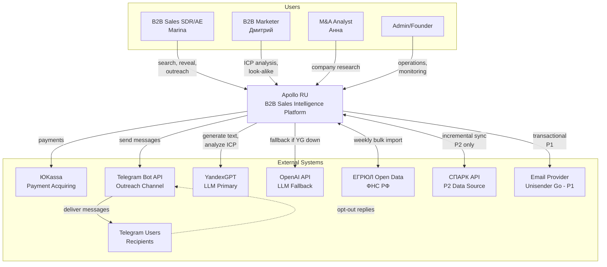
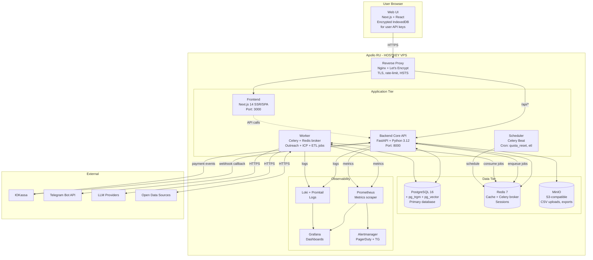
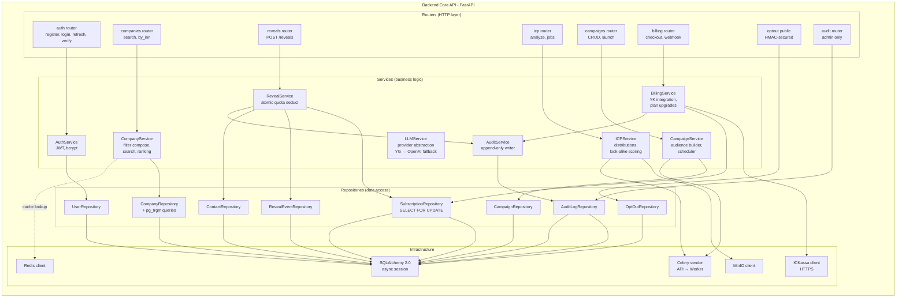
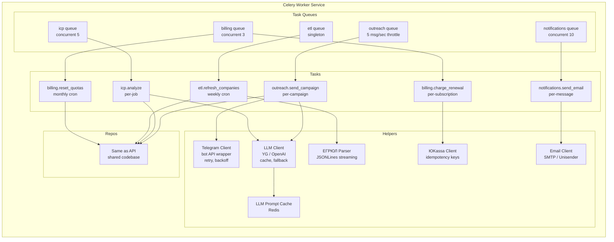
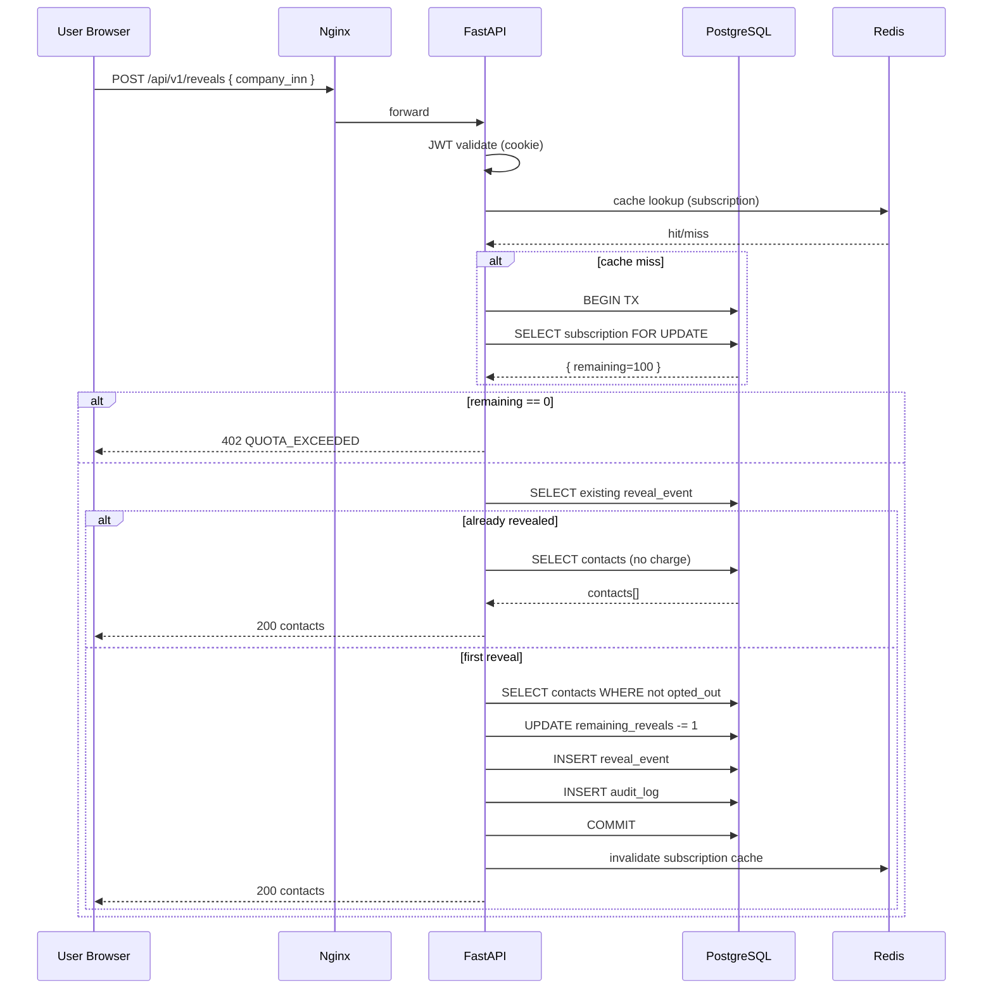
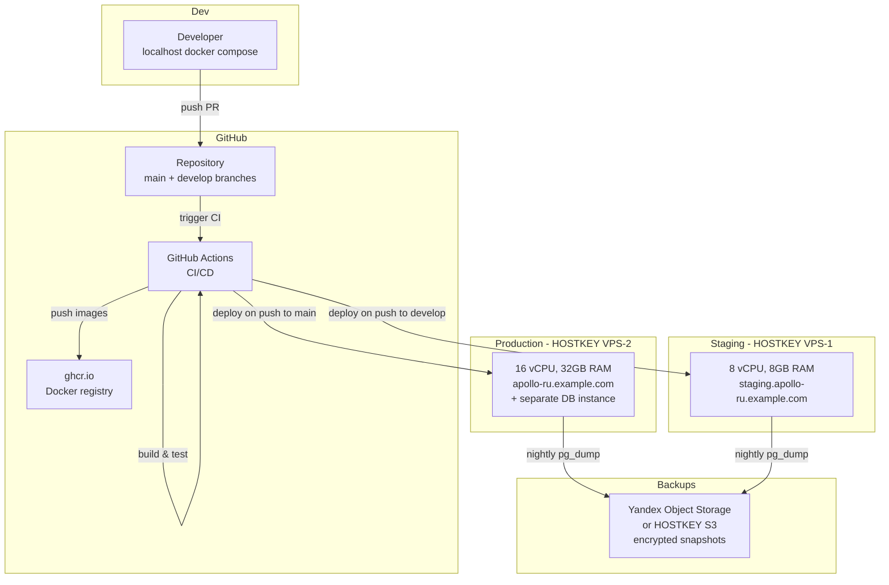
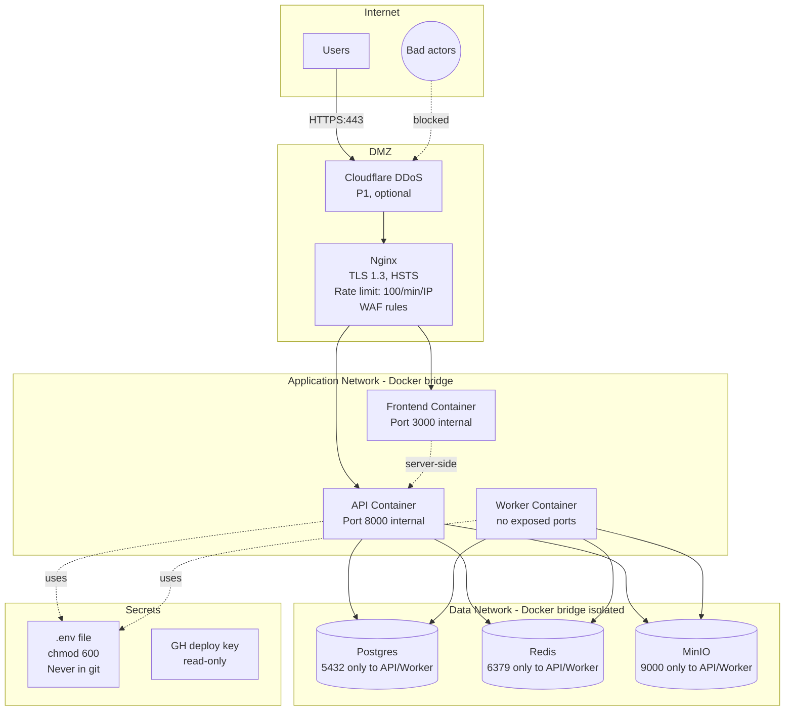

# C4 Diagrams: Apollo (RU)

> System Context, Container, Component diagrams.

## Level 1: System Context



## Level 2: Container Diagram



## Level 3: Component Diagram — Backend Core API



## Level 3: Component Diagram — Worker Service



## Sequence Diagram: Reveal Flow



## Sequence Diagram: Outreach Campaign Launch

```mermaid
sequenceDiagram
    participant U as User
    participant API as FastAPI
    participant DB as PostgreSQL
    participant CR as Celery (Redis)
    participant W as Worker
    participant LLM as YandexGPT
    participant TG as Telegram Bot API

    U->>API: POST /api/v1/campaigns/:id/launch
    API->>DB: SELECT campaign, audience
    API->>DB: INSERT campaign_messages (status=queued)
    API->>DB: UPDATE campaign.status = 'scheduled'
    API->>CR: enqueue outreach.send_campaign(id)
    API-->>U: 202 { campaign_id, status }

    Note over W: Worker picks up task
    W->>DB: UPDATE status = 'running'
    
    loop For each contact
      W->>DB: Check opt_out, recently_contacted
      alt skip
        W->>DB: UPDATE message.status = 'skipped'
      else send
        W->>DB: SELECT FOR UPDATE remaining_outreach
        alt quota exhausted
          W->>DB: UPDATE message.status = 'skipped' (QUOTA)
          W->>DB: UPDATE campaign.status = 'completed'
          break
        else has quota
          alt ai_personalize
            W->>LLM: generate(template, company_ctx)
            LLM-->>W: personalized text
          end
          W->>TG: sendMessage(@username, text)
          alt success
            TG-->>W: 200
            W->>DB: UPDATE message.status = 'sent'
          else error
            TG-->>W: error code
            W->>DB: UPDATE message.status = 'errored'
          end
          W->>W: sleep(0.2)  # throttle
        end
      end
    end
    
    W->>DB: UPDATE campaign.status = 'completed'
    
    Note over TG: Async events
    TG-->>W: webhook (delivered, read, replied)
    W->>DB: UPDATE message.status accordingly
```

## Deployment Diagram



## Network / Security Diagram



## Notes

- All диаграммы рендерятся mermaid
- Для C4 diagrams в Confluence/Notion — экспорт через mermaid-cli в SVG
- Обновлять диаграммы синхронно с major изменениями архитектуры (см. ADR.md)
