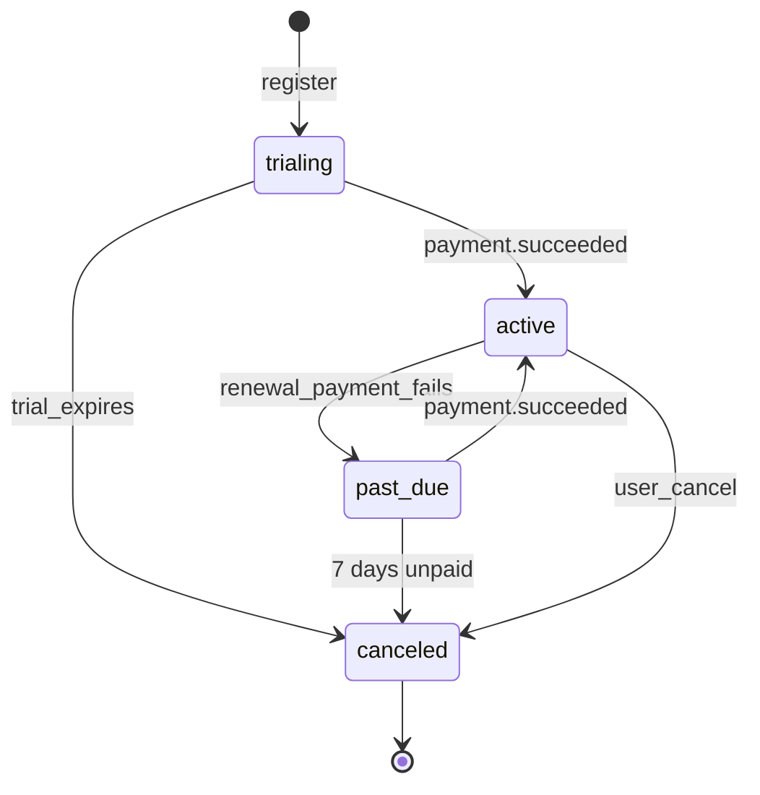
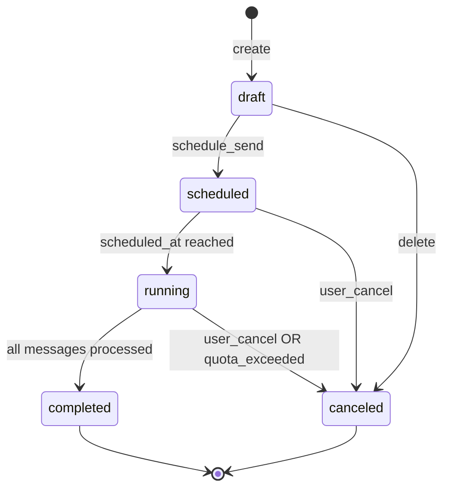
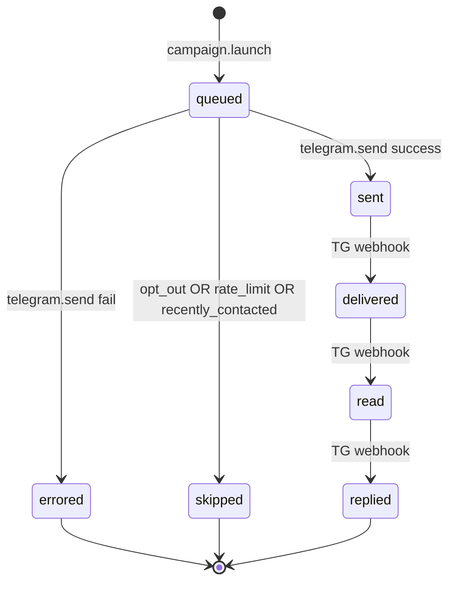

# Pseudocode: Apollo (RU)

> SPARC Phase 4 output. Algorithms, API contracts, data flow.

## Data Structures

```typescript
type UUID = string

type User = {
  id: UUID
  email: string
  password_hash: string
  status: 'pending_verification' | 'active' | 'suspended' | 'deleted'
  pdn_consent_at: Timestamp
  created_at: Timestamp
}

type Plan = {
  code: 'free' | 'starter' | 'pro' | 'team' | 'enterprise'
  price_kopecks: number
  reveal_quota: number
  outreach_quota: number
  seats: number
  ai_personalize: boolean
}

type Subscription = {
  id: UUID
  user_id: UUID
  plan_code: Plan['code']
  status: 'trialing' | 'active' | 'past_due' | 'canceled'
  period_start: Timestamp
  period_end: Timestamp
  remaining_reveals: number
  remaining_outreach: number
  yookassa_payment_method_id: string | null
}

type Company = {
  inn: string                    // 10-12 digits
  name: string
  okved_main: string | null      // "62.01"
  region: string | null
  employee_count: number | null
  revenue_range: '<10M' | '10M-50M' | '50M-100M' | '100M-500M' | '500M-1B' | '1B-10B' | '10B+' | null
  address: string | null
  director: string | null
  embedding: number[] | null     // 384-dim vector for look-alike
  data_source: 'egrul' | 'edisclosure' | 'manual' | 'spark'
  updated_at: Timestamp
}

type Contact = {
  id: UUID
  company_inn: string
  name: string | null
  title: string | null
  email: string | null
  phone: string | null
  telegram: string | null         // @username, без @
  source_url: string | null
  confidence: 'low' | 'medium' | 'high'
  opted_out: boolean
}

type RevealEvent = {
  id: UUID
  user_id: UUID
  company_inn: string
  credit_cost: number
  created_at: Timestamp
}

type ICPProfile = {
  id: UUID
  user_id: UUID
  name: string
  uploaded_inns: string[]
  llm_summary: string
  industry_distribution: Record<string, number>  // okved -> percentage
  size_distribution: Record<string, number>
  region_distribution: Record<string, number>
}

type Campaign = {
  id: UUID
  user_id: UUID
  name: string
  channel: 'telegram' | 'email'
  template: string
  ai_personalize: boolean
  status: 'draft' | 'scheduled' | 'running' | 'completed' | 'canceled'
  scheduled_at: Timestamp | null
}

type CampaignMessage = {
  id: UUID
  campaign_id: UUID
  contact_id: UUID
  rendered_text: string
  status: 'queued' | 'sent' | 'delivered' | 'read' | 'replied' | 'errored' | 'skipped'
  error_code: string | null
  sent_at: Timestamp | null
}
```

## Core Algorithms

### Algorithm 1: Reveal Contact (atomic with quota deduction)

```
INPUT: user_id: UUID, company_inn: string
OUTPUT: contacts: Contact[]  OR  error: 402 QUOTA_EXCEEDED / 404 NOT_FOUND

STEPS:
1. BEGIN TRANSACTION (isolation: REPEATABLE READ)

2. existing_reveal := SELECT 1 FROM reveal_events 
                      WHERE user_id = ? AND company_inn = ?
   IF existing_reveal:
     contacts := SELECT * FROM contacts WHERE company_inn = ? AND opted_out = false
     COMMIT
     RETURN contacts  # already paid for, no charge

3. sub := SELECT * FROM subscriptions 
          WHERE user_id = ? AND status = 'active' 
          FOR UPDATE
   
   IF sub.remaining_reveals <= 0:
     ROLLBACK
     RETURN 402 QUOTA_EXCEEDED

4. company := SELECT 1 FROM companies WHERE inn = ?
   IF NOT company:
     ROLLBACK
     RETURN 404 NOT_FOUND

5. UPDATE subscriptions SET remaining_reveals = remaining_reveals - 1 
   WHERE id = sub.id

6. INSERT INTO reveal_events (user_id, company_inn, credit_cost) VALUES (?, ?, 1)

7. INSERT INTO audit_log (user_id, action, entity_type, entity_id, metadata)
   VALUES (?, 'reveal_contact', 'company', ?, '{"credits_used":1}')

8. contacts := SELECT * FROM contacts WHERE company_inn = ? AND opted_out = false

9. COMMIT
   RETURN contacts

COMPLEXITY: O(1) — индексы на reveal_events(user_id, company_inn), contacts(company_inn)
```

### Algorithm 2: Company Search with Filters

```
INPUT: 
  okved_prefixes: string[]        # ["62.01", "62.02"]
  regions: string[]
  employee_min: number | null
  employee_max: number | null
  revenue_ranges: string[]
  query: string                    # search by name or ИНН
  sort: 'relevance' | 'revenue_desc' | 'employees_desc' | 'name_asc'
  page: number
  page_size: number                # max 100
OUTPUT:
  total: number
  companies: Company[]

STEPS:
1. base_sql := "SELECT * FROM companies WHERE 1=1"

2. IF okved_prefixes:
     # Match prefix: "62" matches "62.01", "62.02.1"
     conditions += "(okved_main LIKE '62%' OR okved_main LIKE '63%' ...)"

3. IF regions:
     conditions += "region = ANY($regions)"

4. IF employee_min OR employee_max:
     conditions += "employee_count BETWEEN $min AND $max"

5. IF revenue_ranges:
     conditions += "revenue_range = ANY($revenue_ranges)"

6. IF query:
     IF query matches /^[0-9]{10,12}$/:
       # ИНН search
       conditions += "inn = $query"
     ELSE:
       # Fuzzy name search via pg_trgm
       conditions += "name % $query"  # similarity > 0.3
       
7. count_sql := "SELECT COUNT(*) FROM (...)"
   total := exec(count_sql)

8. order_clause := match sort:
     'relevance'      → IF query: "ORDER BY similarity(name, $query) DESC"
                       ELSE: "ORDER BY updated_at DESC"
     'revenue_desc'   → "ORDER BY revenue_range_to_int(revenue_range) DESC"
     'employees_desc' → "ORDER BY employee_count DESC NULLS LAST"
     'name_asc'       → "ORDER BY name ASC"

9. result_sql := "SELECT * FROM companies WHERE ... ORDER BY ... LIMIT $page_size OFFSET $offset"
   companies := exec(result_sql)

10. RETURN { total, companies }

COMPLEXITY: 
  - Filtered (okved + region): O(log n) via composite index
  - Fuzzy name search: O(n^0.5) via GIN trigram index
  - Worst case (no filters, sorted by updated_at): O(n log n)
```

### Algorithm 3: AI ICP Analysis

```
INPUT:
  user_id: UUID
  uploaded_inns: string[]   # min 20
OUTPUT:
  profile: ICPProfile
  look_alikes: Company[]   # top 100

STEPS:
1. # Validate input
   IF len(uploaded_inns) < 20:
     RETURN 400 INSUFFICIENT_ICP_DATA
   
   matched_companies := SELECT * FROM companies WHERE inn = ANY($inns)
   match_rate := len(matched_companies) / len(uploaded_inns)
   IF match_rate < 0.3:
     RETURN 400 LOW_MATCH_RATE  # too many unknown ИНН

2. # Build distributions
   industry_dist := group_by(matched_companies, "okved_main") |> percentage()
   size_dist     := bucket_by(matched_companies, "employee_count", buckets=[10,50,200,500,1000]) |> percentage()
   region_dist   := group_by(matched_companies, "region") |> percentage()
   revenue_dist  := group_by(matched_companies, "revenue_range") |> percentage()

3. # LLM summary (YandexGPT)
   prompt := build_icp_prompt(industry_dist, size_dist, region_dist, revenue_dist)
   llm_summary := LLM.generate(prompt, max_tokens=600, temperature=0.3)

4. # Find look-alikes
   IF embeddings_available:                   # P2: vector similarity
     query_embedding := mean([c.embedding for c in matched_companies])
     candidates := SELECT * FROM companies 
                   WHERE inn != ALL($uploaded_inns)
                   ORDER BY embedding <=> $query_embedding
                   LIMIT 500
     scored := [(c, cosine_similarity(c.embedding, query_embedding)) for c in candidates]
   ELSE:                                      # MVP: rule-based
     dominant_okved := top_3(industry_dist)
     dominant_region := top_3(region_dist)
     candidates := SELECT * FROM companies 
                   WHERE okved_main IN $dominant_okved
                     AND region IN $dominant_region
                     AND inn != ALL($uploaded_inns)
                   LIMIT 500
     # score by overlap: 0.4*industry + 0.2*region + 0.3*size + 0.1*revenue
     scored := [(c, score(c, industry_dist, size_dist, region_dist, revenue_dist)) for c in candidates]
   
   look_alikes := top(scored, key=lambda x: x[1], n=100)

5. # Persist profile
   profile := INSERT INTO icp_profiles (...) RETURNING *

6. RETURN { profile, look_alikes }

COMPLEXITY:
  - MVP rule-based: O(N + 500*4) where N = filtered candidates
  - P2 vector: O(log N) via ivfflat index, O(500) for cosine ranking
  - LLM call: 1 request (~3-10s)
```

### Algorithm 4: Outreach Send Loop

```
TASK: outreach.send_campaign(campaign_id: UUID)

INPUT: campaign_id
OUTPUT: void (status updates persisted)

STEPS:
1. campaign := SELECT * FROM campaigns WHERE id = ? AND status = 'scheduled'
   IF NOT campaign: RETURN
   
   UPDATE campaigns SET status = 'running' WHERE id = ?

2. # Eligible recipients
   contacts := SELECT c.* FROM campaign_messages cm 
               JOIN contacts c ON cm.contact_id = c.id
               WHERE cm.campaign_id = ? AND cm.status = 'queued'
   
3. # Per-recipient lifetime check (max 1 message/30 days)
   recently_messaged := SELECT contact_id FROM campaign_messages 
                        WHERE contact_id = ANY($contact_ids) 
                          AND status IN ('sent','delivered','read','replied')
                          AND sent_at > NOW() - INTERVAL '30 days'
                          AND campaign_id IN (SELECT id FROM campaigns WHERE user_id = ?)
   
4. FOR each contact in contacts:
     IF contact.id IN recently_messaged:
       UPDATE campaign_messages SET status='skipped', error_code='RECENTLY_CONTACTED'
       continue

     # Check opt-out
     IF EXISTS (SELECT 1 FROM opt_outs WHERE identifier = contact.telegram AND identifier_type='telegram'):
       UPDATE campaign_messages SET status='skipped', error_code='OPTED_OUT'
       continue

     # Render text
     IF campaign.ai_personalize:
       company := SELECT * FROM companies WHERE inn = contact.company_inn
       text := LLM.personalize(campaign.template, {
                 contact: contact,
                 company: company,
               }, max_tokens=300, temperature=0.7)
     ELSE:
       text := render_template(campaign.template, {
                 company_name: company.name,
                 director: company.director,
                 contact_name: contact.name,
               })

     # Decrement quota (atomic)
     UPDATE subscriptions SET remaining_outreach = remaining_outreach - 1
       WHERE user_id = ? AND remaining_outreach > 0
       RETURNING remaining_outreach
     IF rowcount == 0:
       UPDATE campaign SET status='canceled' 
       LOG "outreach quota exceeded mid-campaign"
       BREAK

     # Send via Telegram Bot API
     try:
       result := telegram.send_message(chat="@" + contact.telegram, text=text)
       UPDATE campaign_messages SET 
         rendered_text = text,
         status = 'sent',
         sent_at = NOW()
     except TelegramAPIError as e:
       UPDATE campaign_messages SET 
         rendered_text = text,
         status = 'errored',
         error_code = e.code   # e.g. 'USER_BLOCKED_BOT', 'RATE_LIMIT'
     
     # Throttle: 5 msg/sec
     sleep(0.2)

5. UPDATE campaigns SET status = 'completed' WHERE id = ?

COMPLEXITY: O(N) where N = #contacts × throttle delay
RETRY: per-message retry on transient errors (RATE_LIMIT) with exponential backoff
```

### Algorithm 5: Quota Reset (Celery Beat)

```
TASK: billing.reset_quotas()

SCHEDULE: 0 0 1 * *   # 00:00 1st of month MSK

STEPS:
1. now := utc_now()
2. expired_subs := SELECT * FROM subscriptions 
                   WHERE period_end <= now AND status = 'active'
3. FOR each sub:
     # Charge ЮKassa for renewal
     IF sub.yookassa_payment_method_id:
       try:
         charge := yookassa.create_payment(
           amount=plan.price_kopecks,
           payment_method_id=sub.yookassa_payment_method_id,
           idempotence_key=hash(sub.id, sub.period_end)
         )
       except PaymentFailed:
         UPDATE subscriptions SET status='past_due'
         send_email(sub.user_id, 'payment_failed')
         continue
     
     UPDATE subscriptions SET 
       period_start = sub.period_end,
       period_end = sub.period_end + INTERVAL '1 month',
       remaining_reveals = plan.reveal_quota,
       remaining_outreach = plan.outreach_quota
     
     INSERT INTO audit_log (user_id, action, ...) VALUES (?, 'subscription_renewed', ...)

COMPLEXITY: O(N) where N = active paying subscriptions
```

## API Contracts

### Auth

#### `POST /api/v1/auth/register`
```
Request:
  Headers: Content-Type: application/json
  Body: {
    email: string,
    password: string (min 8 chars, 1 uppercase, 1 digit),
    pdn_consent: true,
    marketing_consent: boolean
  }

Response 201 Created:
  {
    user_id: UUID,
    email: string,
    status: 'pending_verification'
  }

Response 400:
  { error: { code: 'WEAK_PASSWORD' | 'INVALID_EMAIL' | 'PDN_CONSENT_REQUIRED', message: string } }

Response 409:
  { error: { code: 'EMAIL_EXISTS' } }
```

#### `POST /api/v1/auth/login`
```
Request:
  Body: { email: string, password: string }

Response 200:
  Set-Cookie: access=<jwt>; HttpOnly; Secure; SameSite=Lax
  Set-Cookie: refresh=<jwt>; HttpOnly; Secure; SameSite=Strict; Path=/api/v1/auth/refresh
  Body: { user: User, subscription: Subscription }

Response 401:
  { error: { code: 'INVALID_CREDENTIALS' } }
```

### Companies

#### `GET /api/v1/companies?okved=62&region=Москва&page=1`
```
Query:
  okved: string (comma-separated prefixes)
  region: string (comma-separated)
  employees_min: number
  employees_max: number
  revenue: string (comma-separated buckets)
  query: string (substring or ИНН)
  sort: 'relevance' | 'revenue_desc' | 'employees_desc' | 'name_asc'
  page: number (1-based)
  page_size: number (1-100, default 20)

Response 200:
  {
    total: 247,
    page: 1,
    page_size: 20,
    companies: [
      {
        inn: '7707083893',
        name: 'ПАО Сбербанк',
        okved_main: '64.19',
        region: 'Москва',
        revenue_range: '10B+',
        employee_count: 286000,
        director: 'Греф Герман Оскарович',
        ...
      },
      ...
    ]
  }
```

#### `GET /api/v1/companies/:inn`
```
Response 200:
  {
    company: Company,
    contacts_summary: { total: 3, revealed: false }
  }
```

#### `POST /api/v1/reveals`
```
Request:
  Body: { company_inn: string }
  Auth: required

Response 200:
  {
    company_inn: string,
    contacts: Contact[],
    remaining_credits: number
  }

Response 402:
  { error: { code: 'QUOTA_EXCEEDED', message: '...' } }

Response 404:
  { error: { code: 'COMPANY_NOT_FOUND' } }
```

### ICP

#### `POST /api/v1/icp/analyze`
```
Request:
  Body (multipart/form-data):
    file: CSV file with column 'inn'
    name: string (optional, profile name)
  Auth: required
  Plan: pro+ (otherwise 403)

Response 202 Accepted:
  { job_id: UUID, status_url: '/api/v1/icp/jobs/:job_id' }

Response 400:
  { error: { code: 'INSUFFICIENT_ICP_DATA' | 'LOW_MATCH_RATE' } }
```

#### `GET /api/v1/icp/jobs/:job_id`
```
Response 200:
  {
    status: 'pending' | 'running' | 'completed' | 'failed',
    progress: 0..100,
    result: ICPProfile | null,
    look_alikes: Company[] | null
  }
```

### Campaigns

#### `POST /api/v1/campaigns`
```
Request:
  Body:
    name: string
    channel: 'telegram'
    template: string (with {placeholders})
    ai_personalize: boolean
    audience: 
      | { type: 'search', query: <SearchParams> }
      | { type: 'icp', icp_profile_id: UUID }
      | { type: 'csv', file_id: UUID }
    schedule: 'now' | { at: ISO8601 }
  Auth: required

Response 201:
  { 
    campaign_id: UUID, 
    estimated_recipients: number,
    estimated_cost_credits: number  # usually 1 per recipient
  }
```

#### `POST /api/v1/campaigns/:id/launch`
```
Response 202:
  { campaign_id: UUID, status: 'scheduled' | 'running' }
```

### Billing

#### `POST /api/v1/billing/checkout`
```
Request:
  Body: { plan_code: 'starter' | 'pro' | 'team' }

Response 200:
  { 
    checkout_url: 'https://yookassa.ru/checkout/...',
    payment_id: string
  }
```

#### `POST /api/v1/billing/yookassa-webhook`
```
Headers: X-Yookassa-Signature: <hmac>
Body: <yookassa event payload>

# Verify HMAC, route by event.type:
#   payment.succeeded → activate subscription
#   payment.canceled → schedule downgrade

Response 200: {} (must respond fast or YK retries)
```

### Opt-out (public, no auth)

#### `GET /optout?email=X&token=Y`
```
# Verify HMAC token (prevents enumeration)
# Insert into opt_outs
# Render confirmation page

Response 200: HTML "Вы отписаны от outreach Apollo"
```

## State Transitions

### Subscription State Machine



### Campaign State Machine



### Campaign Message State Machine



## Error Handling Strategy

### Error Categories

| Category | HTTP | Error code prefix | Handling |
|----------|------|-------------------|----------|
| Auth | 401, 403 | AUTH_ | Show login modal / upgrade prompt |
| Validation | 400 | VALIDATION_ | Show inline form errors |
| Quota | 402 | QUOTA_ | Show upgrade modal |
| Not found | 404 | NOT_FOUND_ | Empty state |
| Conflict | 409 | CONFLICT_ | Show specific message |
| Rate limit | 429 | RATE_LIMIT_ | Retry with backoff |
| Server error | 500 | INTERNAL_ | Generic error toast + log |
| Upstream (LLM, TG, YK) | 502 | UPSTREAM_ | Retry policy + circuit breaker |

### Standard Error Response

```json
{
  "error": {
    "code": "QUOTA_EXCEEDED",
    "message": "Лимит исчерпан. Обновите тариф.",
    "details": { "plan": "free", "remaining": 0, "quota": 25 },
    "request_id": "uuid"
  }
}
```

### Retry Policies

| Operation | Strategy |
|-----------|----------|
| LLM API call | 3 retries, exponential backoff (1s, 4s, 16s), then fallback to template |
| Telegram send | 5 retries on RATE_LIMIT, exponential, max 60s. Fail on USER_BLOCKED |
| ЮKassa webhook | YK retries (нам нужно отвечать 200 быстро) |
| ETL bulk download | 3 retries on network error, fail fast on data corruption |

## Idempotency

| Endpoint | Idempotency mechanism |
|----------|----------------------|
| POST /reveals | unique(user_id, company_inn) — second call returns same data |
| POST /billing/yookassa-webhook | dedup by event.id |
| POST /campaigns/:id/launch | состояние scheduled → idempotent |
| ЮKassa charge | idempotence_key = hash(subscription_id, period_end) |
